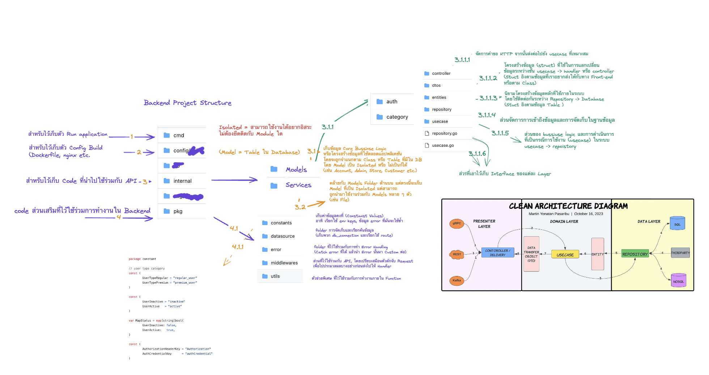

# internProject_backend
intern project shopping website backend

## Project Structure



```
├── cmd                     # ตัว Entry-point ของ Application 
├── config                  # config build application
├── internal                # Core business source code
├── pkg                     # code ที่เก็บข้อมูลที่ใช้ร่วมกับ Application
├── migration               # สำหรับเก็บ database ที่ถูก migrated
```